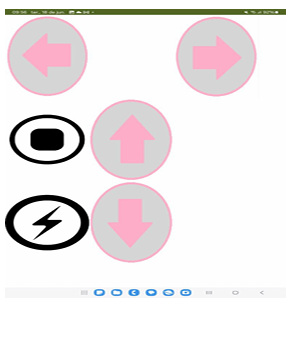
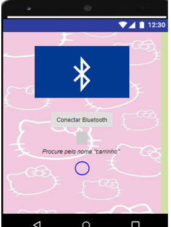
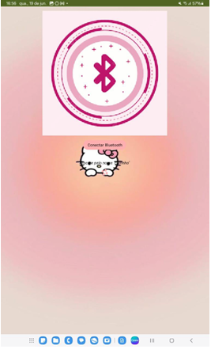
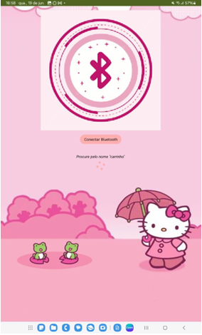
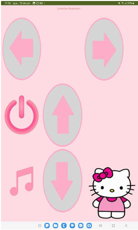

# CUTE ARDUINE AUTOMOTIVE

**PONTÍFICIA UNIVERSIDADE CATÓLICA DE MINAS GERAIS/ UNIDADE PRAÇA DA LIBERDADE**

**ENGENHARIA DE COMPUTAÇÃO - 1º PERÍODO**

**LABORATÓRIO DE INTRODUÇÃO A COMPUTAÇÃO**

**Integrantes:**

- Cauã Diniz Armani
- David Nunes Ribeiro
- Edurado Utsch Gonçalves
- Gabriela Fernandes Bicalho
- Izabela Naves dos Santos
- Júlia de Mello Teixeira
- João Vitor Freire

**Orientador:**

- Felipe Augusto Lara Soares

---

O principal objetivo ao desenvolver o layout foi alinhar-se à temática central do grupo, que incorpora a ideia de um "Monster Truck" com uma abordagem simultaneamente robusta e cativante, evocando reminiscências da infância feminina através de músicas como as da Barbie e da Hello Kitty. Com isso em mente, o design do aplicativo foi concebido em uma paleta de tons variados de rosa.

Recebi o aplicativo da seguinte maneira:

    
    

Em tons de cinza, azul, rosa e preto.

Logo em seguida foram feitos os seguintes testes:

### Primeiro teste:

    

### Segundo Teste:

    

### Terceiro teste:

    
    

### Quarto teste:

    
    

### Resultado final:

    
    

---

### Arquivos do Aplicativo:

Clique [aqui](https://github.com/ICEI-PUC-Minas-EC-TI/ppl-ec-2024-1-p1-liec-t1-cute-arduine-automotive/tree/main/App) para visualizar os arquivos dos aplicativos.

---
