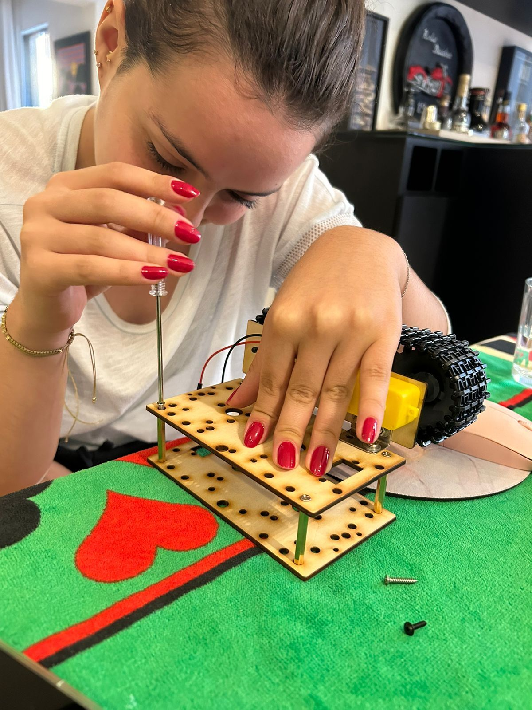
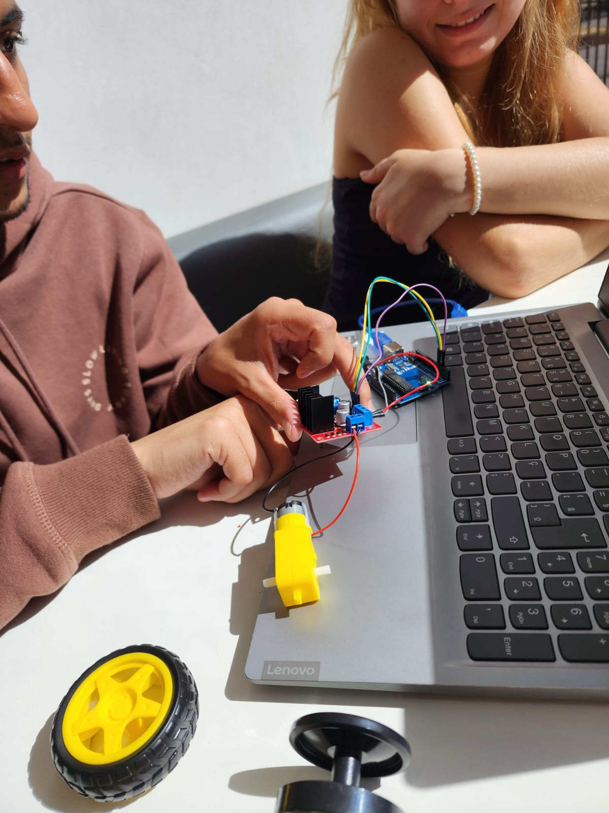
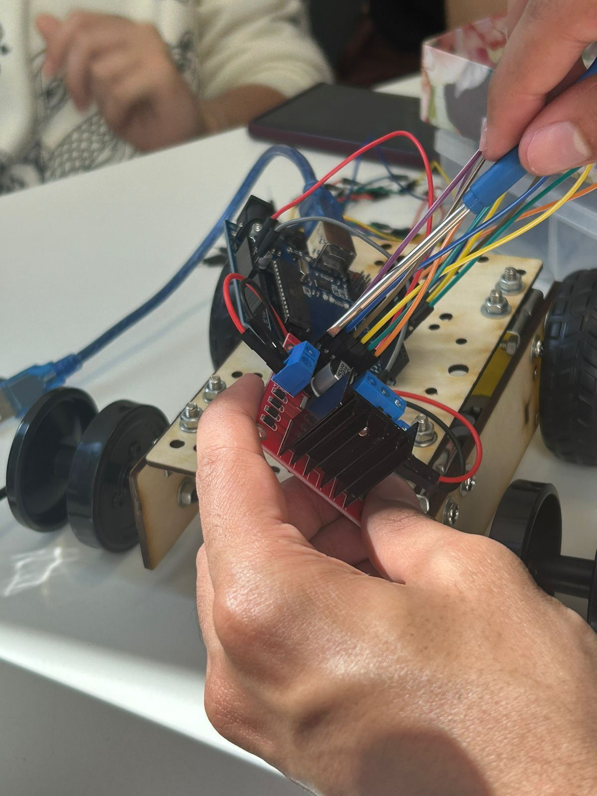
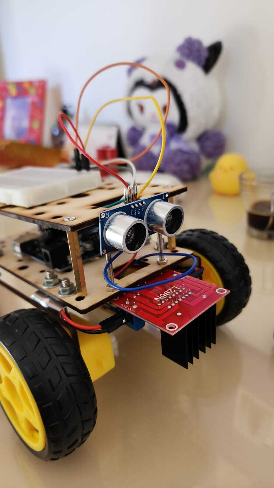
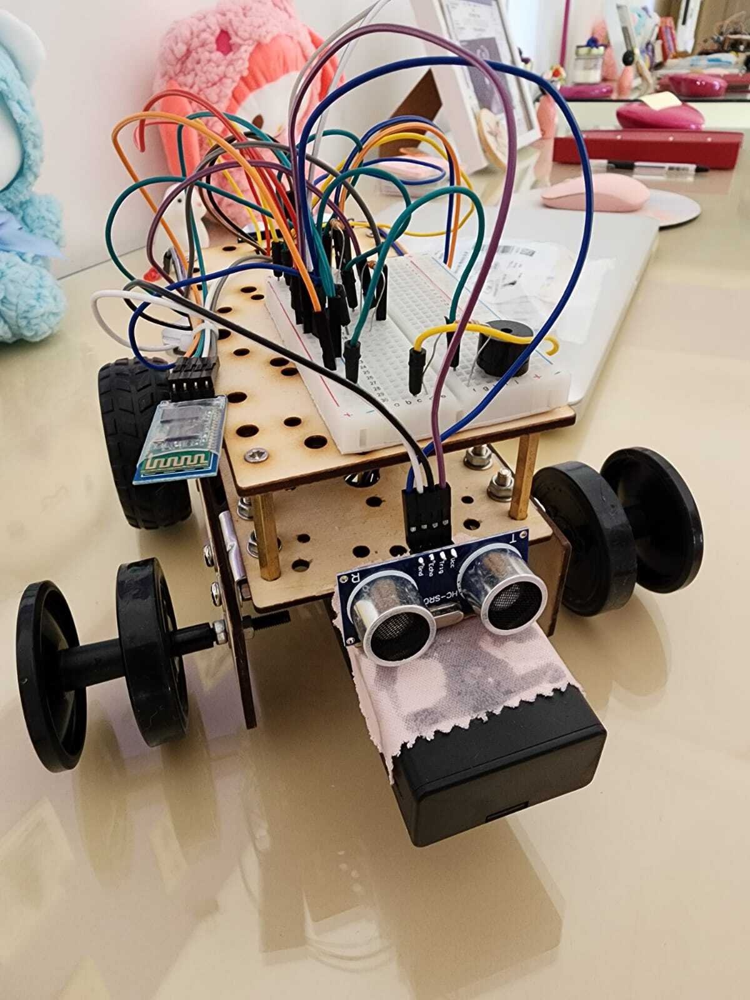
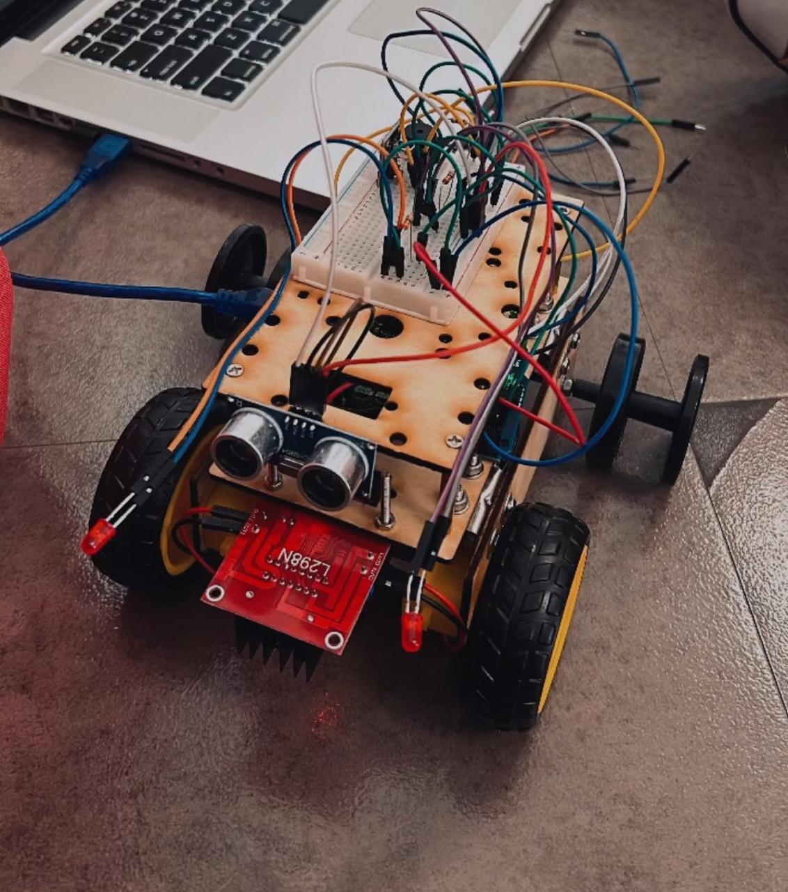

# CUTE ARDUINE AUTOMOTIVE

**PONTÍFICIA UNIVERSIDADE CATÓLICA DE MINAS GERAIS/ UNIDADE PRAÇA DA LIBERDADE**

**ENGENHARIA DE COMPUTAÇÃO - 1º PERÍODO**

**LABORATÓRIO DE INTRODUÇÃO A COMPUTAÇÃO**

**Integrantes:**

- Cauã Diniz Armani
- David Nunes Ribeiro
- Edurado Utsch Gonçalves
- Gabriela Fernandes Bicalho
- Izabela Naves dos Santos
- Júlia de Mello Teixeira
- João Vitor Freire

**Orientador:**

- Felipe Augusto Lara Soares

---

Aqui estão as imagens relacionadas ao projeto:

    
    
    
    
    
    
    
    
    
    

### Vídeo de demonstração:

    <video width="640" height="360" controls>
        <source src="Videos/video_teste_01.mp4" type="video/mp4">
        Your browser does not support the video tag.
    </video>

