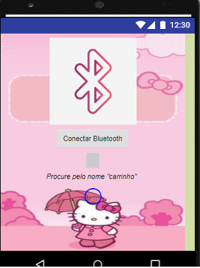
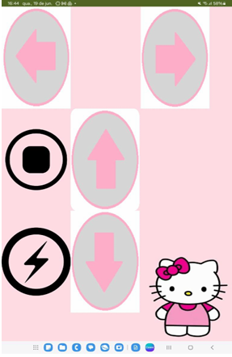
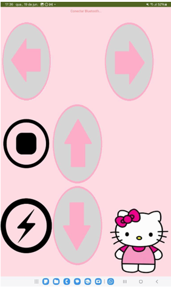
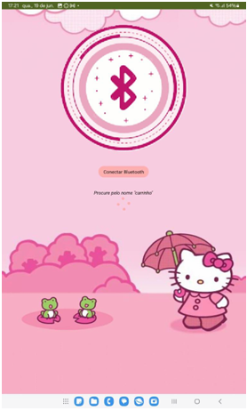



    
CUTE ARDUINE AUTOMOTIVE

    

        PONTÍFICIA UNIVERSIDADE CATÓLICA DE MINAS GERAIS/ UNIDADE PRAÇA DA LIBERDADE
    

    

        ENGENHARIA DE COMPUTAÇÃO - 1º PERÍODO 
        LABORATÓRIO DE INTRODUÇÃO A COMPUTAÇÃO
    

    

        <strong>Integrantes:</strong> 
        Cauã Diniz Armani 
        David Nunes Ribeiro 
        Edurado Utsch Gonçalves 
        Gabriela Fernandes Bicalho 
        Izabela Naves dos Santos 
        Júlia de Mello Teixeira 
        João Vitor Freire
    

    

        <strong>Orientador:</strong> 
        Felipe Augusto Lara Soares
    

O principal objetivo ao desenvolver o layout foi alinhar-se à temática central do grupo, que
incorpora a ideia de um "Monster Truck" com uma abordagem simultaneamente robusta e
cativante, evocando reminiscências da infância feminina através de músicas como as da
Barbie e da Hello Kitty. Com isso em mente, o design do aplicativo foi concebido em uma
paleta de tons variados de rosa.

Recebi o aplicativo da seguinte maneira:

    
    

Em tons de cinza, azul, rosa e preto.

Logo em seguida foram feitos os seguintes testes:

Primeiro teste:

    

Segundo Teste:

    

Terceiro teste:

    
    

Quarto teste:

    
    

Resultado final:

    
    

